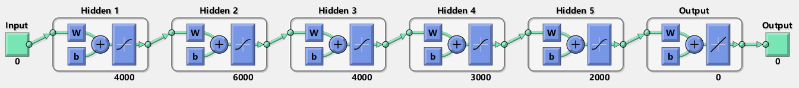
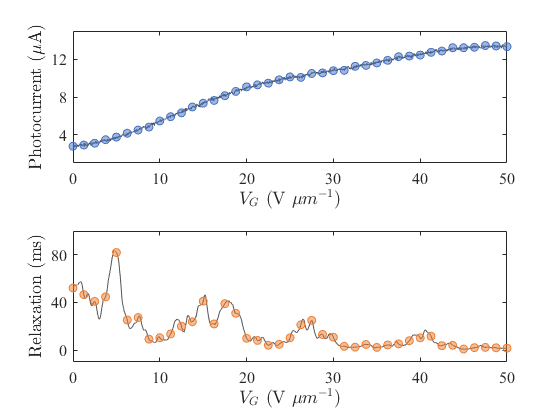
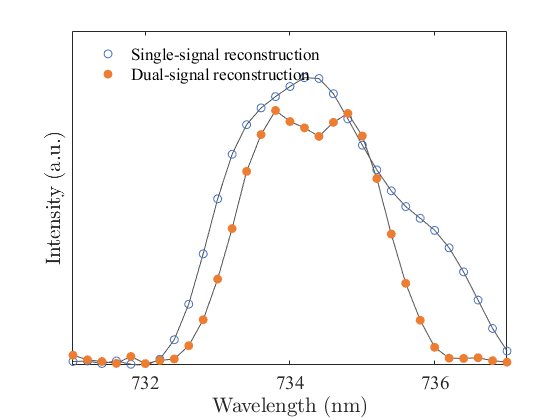

# **Dual-signal spectral reconstruction spectrometer** 

The reconstruction algorithm for dual spectral reconstruction spectrometer includes the training of reconstruction neural network, instrument control and spectral reconstruction.

<!-- PROJECT SHIELDS -->


[![Forks][forks-shield]][forks-url]
[![Stargazers][stars-shield]][stars-url]
[![Contributors][contributors-shield]][contributors-url]
[![Issues][issues-shield]][issues-url]
[![MIT License][license-shield]][license-url]


<!-- PROJECT LOGO -->
<br />

<p align="center">
  <a href="https://github.com/iCalculate/Dual-spectral-reconstruction/">
    
  </a>
  <h3 align="center">Dual-signal spectral reconstruction spectrometer</h3>
  <p align="center">
    Pioneering reconstruction strategy for nm-resolution microspectrometer
    <br />
    <a href="https://github.com/iCalculate/Dual-spectral-reconstruction">View the results</a>
    ·
    <a href="https://github.com/iCalculate/Dual-spectral-reconstruction/issues">Questions for the Author</a>
    ·
    <a href="https://github.com/iCalculate/Dual-spectral-reconstruction/issues">Deep development</a>
  </p>

</p>


## Contents

- [Introduction to the Project](#introduction-to-the-project)
- [File Directory Description](#file-directory-description)
- [Hardware deployment](#hardware-deployment)
- [Network Training](#network-training)
- [Spectrometer Reconstruction](#spectrometer-reconstruction)
- [Acknowledgements](#acknowledgements)
- [Copyright](#copyright)

### Introduction to the Project
The repository showcases the relevant scripts for the dual-signal spectral reconstruction spectrometer, with detailed experimental procedures and physical analysis documented in the research report. The code in the repository primarily demonstrates the training process of the deep neural network used for spectral reconstruction `network_training.m`, as well as how to perform spectral reconstruction based on the trained network `dual_spectral_reconstruction.mlx`.　The repository also includes the open-source control command `instrument control` set for the instrumental equipment required in the experiments, as well as the code for automated experimental operations.

### File Directory Description

```
filetree 
├── README.md		# Project readme text
├── dual_spectral_reconstruction.mlx   # MATLAB Live script for spectral signal acquisition and reconstruction
├── network_training.m   # Deep neural network training script for spectral reconstruction
├── edsignal.mat    # Decoded envelope detector signal
├── pdsignal.mat    # Decoded phase discriminator signal
├── /Figure/
│  ├── Fig3a_sub.png   # ED and PD signal
│  ├── Fig3d.png       # Comparison of reconstructed spectra
│  └── viewnet.png     # Diagram of neural network structure
├── /instrument control/   # Experimental equipment control scripts
│  ├── Keithley.py   # Keithley 2400/2450 scripts
│  ├── Keysight.py   # Keysight signal generator scripts
│  ├── LakeShore.py   # Temperature control module scripts
│  ├── StanfordResearch.py  # SR800 lock-in amplifer scripts
│  ├── Keithley2450_VppIsweep.py  # Script for device transport curve test
│  ├── Keithley2450_Isweep_v2.py  # Script for device bias
│  └── Keithley2450_Vsweep_v1.py  # Script for gate voltage sweep
```
### Hardware Deployment

The master in this experiment is a PC, and the slaver is a Xilinx ZYNQ 7000 FPGA. The slaver communicates with the master through a serial port. The slaver is used to control instrument equipment, provide biases, execute voltage scans, etc. Meanwhile, the slaver reads ED and PD signals through a DAQ card and transmits them back to the master for network training or spectral reconstruction.

### Network Training

Running `network_training.m` trains a deep neural network based on the training dataset. During this process, the network-related parameters are initialized, and initial weights are assigned to the network. The trained network used in this article is obtained from [here](https://drive.google.com/file/d/1jLLEc5U4cwWMceic5N_bjX6VMVlgPXa4/view?usp=drive_link) for reference only. Then, you can use commands to carry out network training or display a schematic diagram of the network structure.
```matlab
[net,tr] = train(net,net_input,net_target);
view(net);
```


### Spectrometer Reconstruction

Run the script `dual_spectral_reconstruction.mlx` to communicate with the FPGA through the serial port and control the FPGA for spectrometer control and data sampling. After sampling is completed, the data is sent back to the master, and the data for PD and ED are plotted. The results are as follows:
```matlab
[pdsignal, edsignal] = decode_rawMat(rawdataMatrix); 
```



After importing the pre-trained matrix, you can use the following command for spectral reconstruction, which will give you the reconstructed spectral data. The results are as follows:
```matlab
reconstructed_spectrum = net(net_input);
```



### Acknowledgements 

We acknowledge the provision of infrastructure and assistance with Alibaba DAMO Academy for Discovery. We thank Z. Wang, Y. Yang, D. Xu, S. Deng, X. Wang, P. Li and C. Yang for the constructive discussions. This work was supported by the National Key Research and Development Program of China (2021YFA0718800), the National Natural Science Foundation of China (52222206, 52372177, U20A20244), Sichuan Science and Technology Program (2021JDTD0010) and Young Scientists Fund of the National Natural Science Foundation of China (52001059).

### Copyright

This project is under [MIT license](https://mit-license.org/)

<!-- links -->

[your-project-path]:iCalculate/Dual-spectral-reconstruction
[contributors-shield]: https://img.shields.io/github/contributors/iCalculate/Dual-spectral-reconstruction.svg?
[contributors-url]: https://github.com/iCalculate/Dual-spectral-reconstruction/graphs/contributors
[forks-shield]: https://img.shields.io/github/forks/iCalculate/Dual-spectral-reconstruction.svg?
[forks-url]: https://github.com/iCalculate/Dual-spectral-reconstruction/network/members
[stars-shield]: https://img.shields.io/github/stars/iCalculate/Dual-spectral-reconstruction.svg?
[stars-url]: https://github.com/iCalculate/Dual-spectral-reconstruction/stargazers
[issues-shield]: https://img.shields.io/github/issues/iCalculate/Dual-spectral-reconstruction.svg?
[issues-url]: https://img.shields.io/github/issues/iCalculate/Dual-spectral-reconstruction.svg
[license-shield]: https://img.shields.io/github/license/iCalculate/Dual-spectral-reconstruction.svg?
[license-url]: https://github.com/iCalculate/Dual-spectral-reconstruction/blob/main/LICENSE
