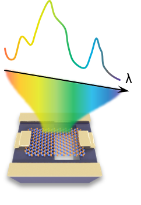

# **Dual-signal spectral reconstruction spectrometer** 

The reconstruction algorithm for dual spectral reconstruction spectrometer includes the training of reconstruction neural network, instrument control and spectral reconstruction

<!-- PROJECT SHIELDS -->


<!-- PROJECT LOGO -->
<br />

<p align="center">
  <a href="https://github.com/iCalculate/Dual-spectral-reconstruction/">
    
  </a>
  <h3 align="center">Dual-signal spectral reconstruction spectrometer</h3>
  <p align="center">
    Pioneering reconstruction strategy to realize nm-resolution microspectrometerr
    <br />P
    <a href="https://github.com/shaojintian/Best_README_template">View the results</a>
    ·
    <a href="https://github.com/shaojintian/Best_README_template/issues">Questions for the Author</a>
    ·
    <a href="https://github.com/shaojintian/Best_README_template/issues">Deep development</a>
  </p>

</p>


## Contents

- [Introduction to the Project](#IntroductiontotheProject)
- [File Directory Description](#FileDirectoryDescription)
- [Hardware deployment](#Hardwaredeployment)
- [Script description](#Scriptdescription)
- [Results](#Results)
- [Contributors](#Contributors)
- [Acknowledgements](#Acknowledgements)
- [Copyright](#Copyright)

### Introduction to the Project


### File Directory Description

```
filetree 
├── README.md		# Project
├── dual_spectral_reconstruction.mlx
├── network_training.m
├── edsignal.mat
├── pdsignal.mat
├── /Figure/
│  ├── Fig3a_sub.png
│  ├── Fig3d.png
│  └── viewnet.png
├── /instrument control/
│  ├── Keithley.py
│  ├── Keysight.py
│  ├── LakeShore.py
│  ├── StanfordResearch.py
│  ├── Keithley2450_VppIsweep.py
│  ├── Keithley2450_Isweep_v2.py
│  └── Keithley2450_Vsweep_v1.py
```


### Hardware deployment

请阅读[ARCHITECTURE.md](https://github.com/shaojintian/Best_README_template/blob/master/ARCHITECTURE.md) 查阅为该项目的架构。

### Script description


### Results


### Contributors


### Acknowledgements 

We acknowledge the provision of infrastructure and assistance with Alibaba DAMO Academy for Discovery. We thank Z. Wang, Y. Yang, D. Xu, S. Deng, X. Wang, P. Li and C. Yang for the constructive discussions. This work was supported by the National Key Research and Development Program of China (2021YFA0718800), the National Natural Science Foundation of China (52222206, 52372177, U20A20244), Sichuan Science and Technology Program (2021JDTD0010) and Young Scientists Fund of the National Natural Science Foundation of China (52001059).

### Copyright

This project is under [MIT license](https://mit-license.org/)

